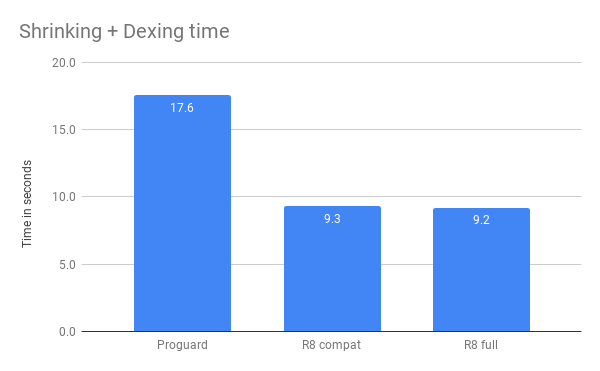
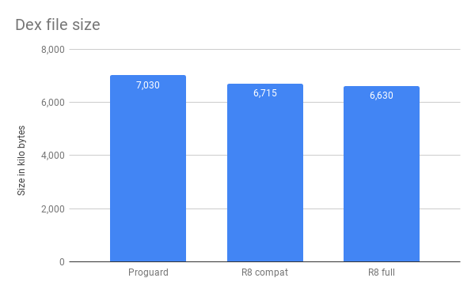
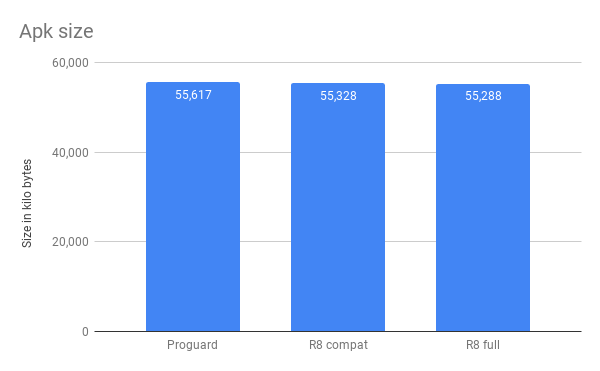

Comparing R8 and Proguard on Google Santa Tracker for Android
===

Setup
---

Santa Tracker is an old sample and in order to properly run the evaluation we updated the project to use the 3.3-beta01 Android Gradle Plugin. In addition, the Santa Tracker proguard configuration was less than ideal. In particular, it told both Proguard and R8 to not optimize and to not obfuscate. We fixed that as well and added the keep rules needed to make the app still work.

The result of these changes is in the santa tracker fork at: https://github.com/madsager/santa-tracker-android which is what has been used for the measurements.

Benchmarking
---

The benchmark results were obtained by using the following steps:

```
./gradlew clean
./gradlew --stop
./gradlew :santa-tracker:assembleRelease &&
./gradlew clean &&
./gradlew :santa-tracker:assembleRelease &&
./gradlew clean &&
./gradlew :santa-tracker:assembleRelease --profile
```

We repeat the build in order to warm up the gradle daemon to get to a typical stable state. On the last run we use --profile which will report timings. The times that we collect are for shrinking and dexing (which with R8 is one step).

We did the above steps 5 times for each setting: Proguard, R8 compat mode and R8 full mode and the numbers reported is the average of the 5 runs.

Concretely we measure the time for the following tasks:

- R8
    - :santa-tracker:transformClassesAndResourcesWithR8ForProductionRelease
- Proguard
    - :santa-tracker:transformClassesAndResourcesWithProguardForProductionRelease
    - :santa-tracker:transformDexArchiveWithDexMergerForProductionRelease	
    - :santa-tracker:transformClassesWithDexBuilderForProductionRelease	

The one R8 task does shrinking, dexing and dex-merging in one step.

Results
---

This section contains the [benchmarking results](benchmarks/data/data.csv). On this benchmark R8 takes 45% less time than Proguard and produces slightly smaller output both in compat and full mode.

These results do not necessarily carry over to other projects. Therefore, please report issues in the R8 public issue tracker if your app gets larger or takes longer to process with R8 compared to Proguard.

Time
---



Size
---





